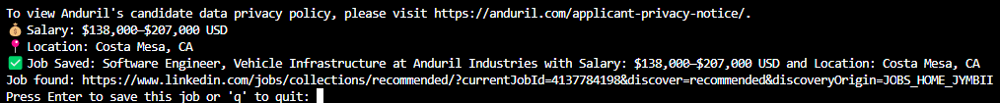

# Automatic Job Application Tracker & Organizer 🚀


**Automatically log LinkedIn job applications to Google Sheets** with one keystroke. Perfect for high-volume job seekers!

---

## 🔍 Overview
### **Problem**
Tracking hundreds of job applications manually is tedious and error-prone. This tool solves:
- **Repetitive data entry** for job titles, companies, and URLs
- **Disorganized tracking** of application statuses and follow-ups
- **No centralized system** for analyzing application success rates

### **Solution**
A Python-based automation tool that:
- Logs LinkedIn job details to Google Sheets with **one keystroke**
- Automatically handles authentication and data formatting
- Provides a foundation for advanced analytics and automation

**Currently Tracked**:
- Job Title
- Company Name
- Application URL
- Salary
- Location

---

## 🛠️ Features
| Feature                | Description                                                                 |
|------------------------|-----------------------------------------------------------------------------|
| **LinkedIn Automation**| Auto-fills credentials and navigates job listings                          |
| **Google Sheets Sync** | Real-time updates to your centralized tracker                              |
| **One-Key Logging**    | Press `Enter` to log jobs after viewing                                    |
| **Secure Storage**     | Encrypted credential management via `credentials.txt`                     |
| **Scalable Architecture** | Modular design for future integrations                                  |

---

## ⚙️ Installation

### Prerequisites
- Python 3.8+
- Google account
- LinkedIn account
- Chrome browser

### Setup Process

#### **1. Clone Repository**
```bash
git clone https://github.com/Bnguy777/Automatic-Job-Application-Organizer.git
cd Automatic-Job-Application-Organizer
```

#### **2. Google Sheets API Setup**
1. Create a new project in [Google Cloud Console](https://console.cloud.google.com/)
2. Enable APIs:
   - Navigate to **APIs & Services > Library**
   - Search for and enable:
     - **Google Sheets API**
     - **Google Drive API**
3. Create Service Account credentials:
   - Go to **APIs & Services > Credentials**
   - Click **+ Create Credentials > Service Account**
   - Fill in service account details
   - Set role to **Owner**
   - Click **Done**
4. Generate credentials file:
   - Under Service Accounts, click your new account
   - Go to **Keys > Add Key > Create New Key**
   - Select **JSON** format and download
   - Rename file to `credentials.json`

#### **3. Configure Google Sheet**
1. Create a new Google Sheet
2. Share the sheet with your service account email:
   - Open sharing settings
   - Add email from `credentials.json` (look for `"client_email"` field)
   - Set permission to **Editor**

#### **4. Dependency Installation**
```bash
python -m pip install --upgrade pip setuptools wheel
pip install spacy --prefer-binary
pip install gspread google-auth selenium webdriver-manager spacy numpy
python -m spacy download en_core_web_sm
```

#### **5. Configure Credentials**
1. Create `credentials.txt` with this format:
   ```
   username=YourLinkedInUsername
   password=YourLinkedInPassword
   spreadsheet_id=YourGoogleSheetId
   ```
2. Get Spreadsheet ID:
   - From your Google Sheet URL:  
     `https://docs.google.com/spreadsheets/d/[THIS_IS_YOUR_SPREADSHEET_ID]/edit`
3. File structure should include:
   ```
   - Chromedriver/
   - credentials.json
   - credentials.txt
   - job.py
   ```

---

## 🚀 Usage
1. **Run the script**:
   ```bash
   python job.py
   ```
2. **Authentication**:
   - Script auto-fills LinkedIn credentials from `credentials.txt`
   - Complete manual CAPTCHA if required
3. **Job Logging**:
   1. Browse LinkedIn jobs normally
   2. When you find a job to track:
      - Return to terminal
      - Press `Enter` to log current job
   3. To quit:
      - Type `q` and press `Enter`
---
## 🖥️ Demo: How It Works

### 1. CAPTCHA Handling (Manual Intervention)
  
*Waiting for you to solve the captcha manually.*  

### 2. One-Key Job Logging (Terminal)
  
*Press Enter in the terminal to log the job you're viewing on LinkedIn.*  

### 3. Automated Google Sheets Update  
  
*Job details (title, company, URL, salary) auto-populated in your tracker.*  
---

## 🌟 Roadmap & Future Directions

### **Core Features**
- [x] Basic LinkedIn-to-Sheets integration
- [ ] Date and Benefits Tracking
- [ ] **Application Status Tracking** (Interview Scheduled/Rejected/Offer)
- [ ] **Auto-Sorting** by location (separate sheets per location)

### **Advanced Features**
- [ ] PostgreSQL integration for advanced querying
- [ ] GUI configuration panel for field selection
- [ ] AI-powered job classification (seniority/industry)
- [ ] Analytics dashboard with success rate metrics

---

*Developed by [Bnguy777](https://github.com/Bnguy777)  
*Report issues [here](https://github.com/Bnguy777/Automatic-Job-Application-Organizer/issues)*

